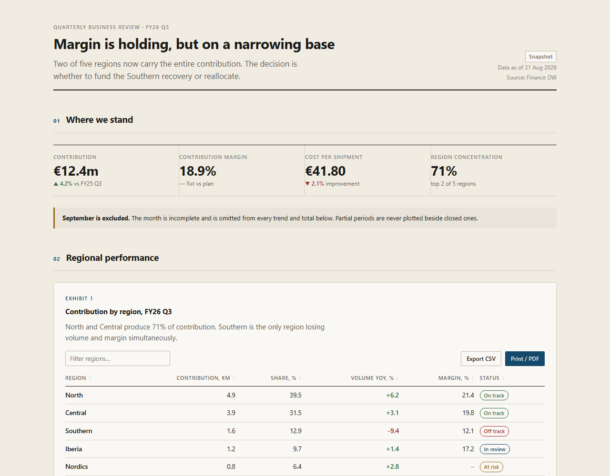
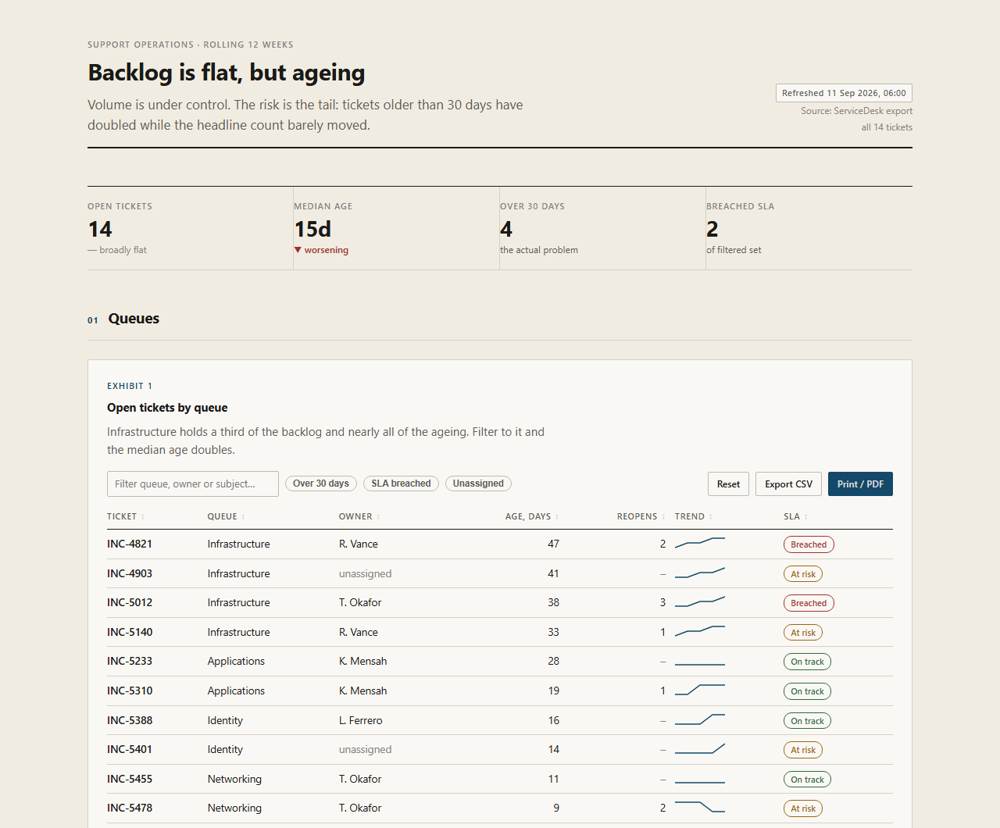
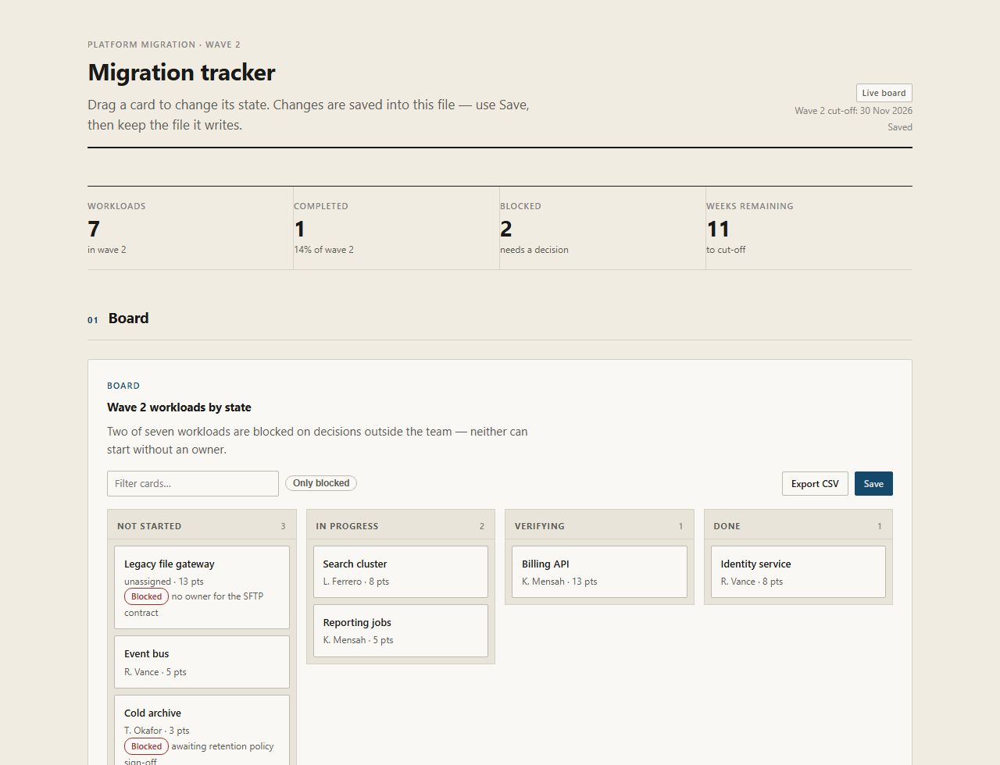
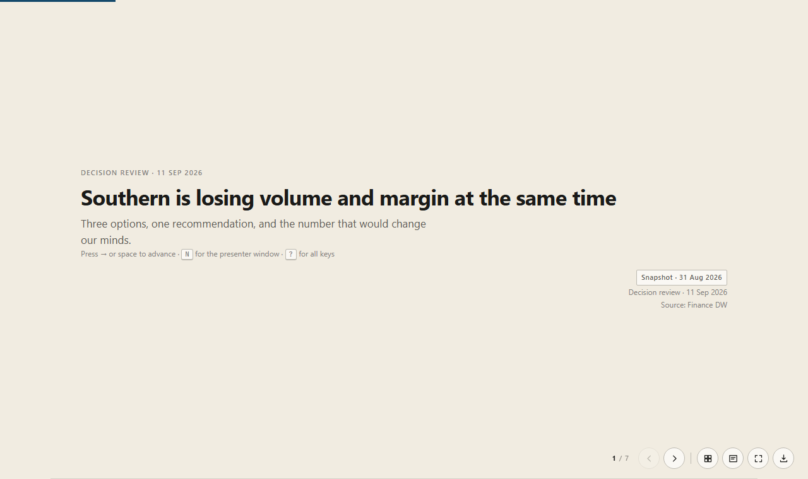
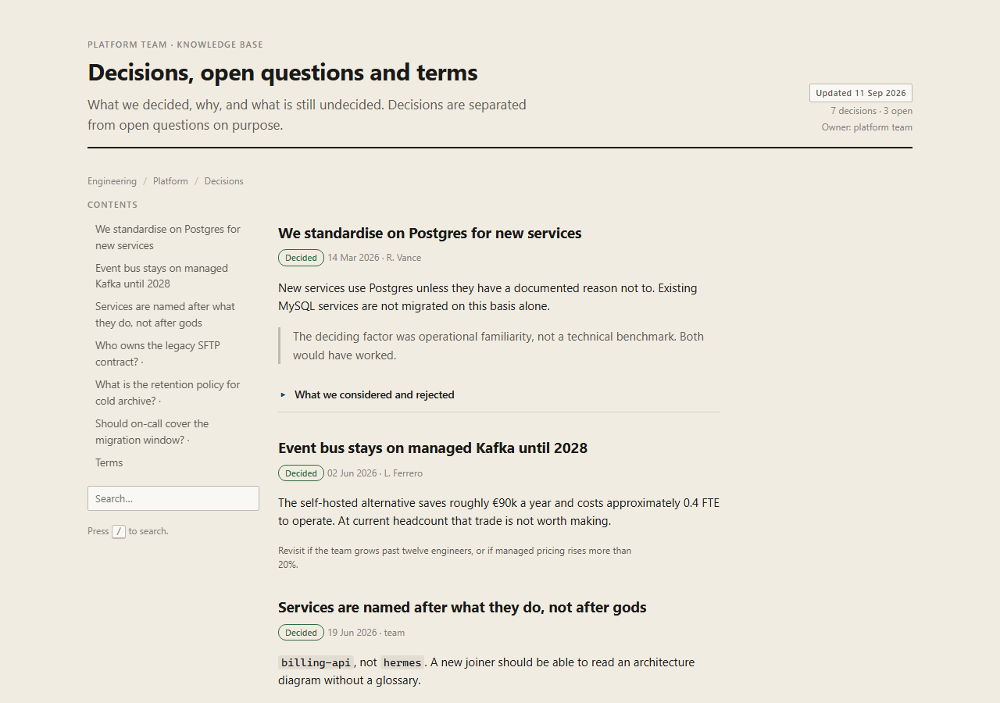
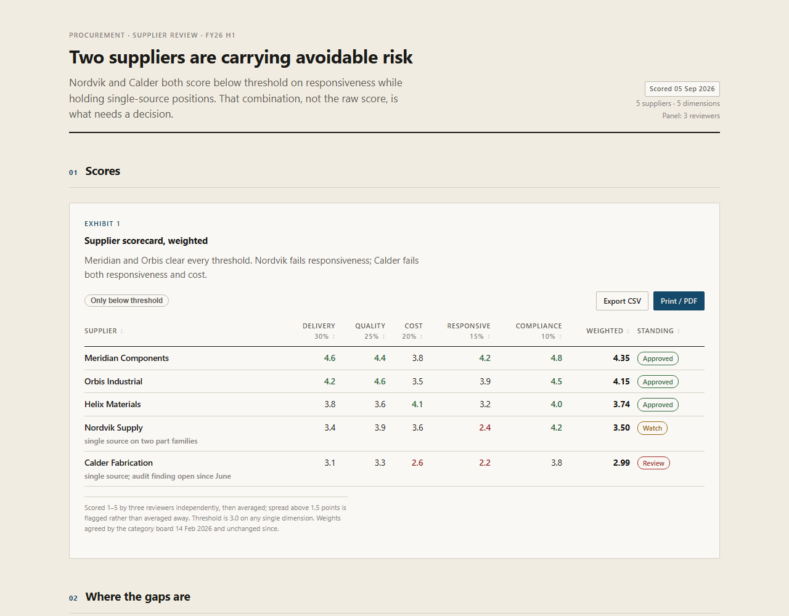
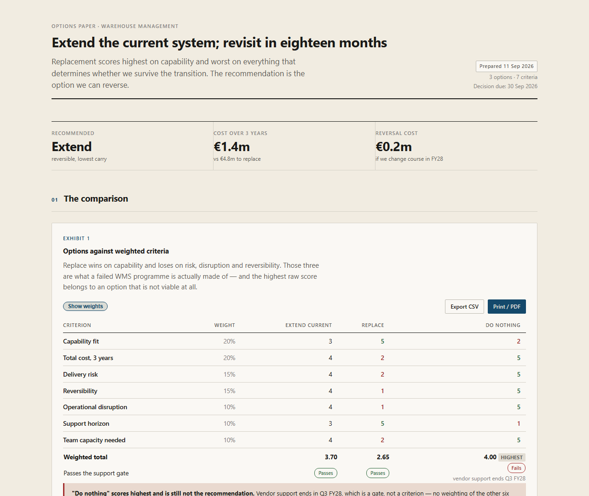
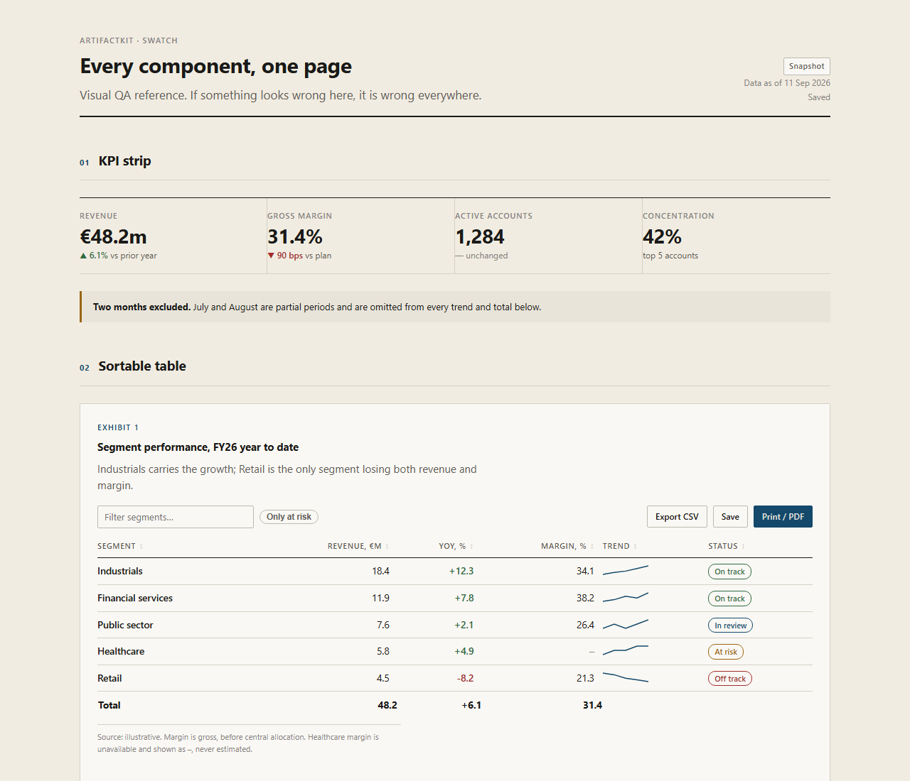

# artifactkit

**A UI kit for AI agents that write HTML.** Reports, dashboards, kanbans, wikis,
scorecards and decks, as one self-contained `.html` file that opens by
double-click with no server, no build and no network.

Zero dependencies in the core. No third-party code in this repository.

**[→ Live gallery](https://vespassassina.github.io/artifactkit/)**

## Why

I ask an agent for a dashboard or a report most weeks. Every time I get
different conventions, a CDN link that dies the moment the file leaves my
laptop, and a chart that quietly plots a half-finished month beside closed ones.
Correcting the same five things on every artifact is not a workflow. So the
corrections live here instead: one vocabulary, a set of content rules, and two
validators that fail the build when an artifact breaks them.

## Templates

Copy one and change the data. Each is a single file with no dependencies.

### Report

[**Demo**](https://vespassassina.github.io/artifactkit/report.html) ·
[source](examples/templates/report.html)

A quarterly review. Action title that states the finding, a KPI strip carrying a
concentration risk rather than only totals, a banner naming the excluded partial
period, and one margin shown as `–` because the source did not deliver it.

[](https://vespassassina.github.io/artifactkit/report.html)

### Dashboard

[**Demo**](https://vespassassina.github.io/artifactkit/dashboard.html) ·
[source](examples/templates/dashboard.html)

Filter chips, search, sparklines in cells, sticky first column. Row detail is a
drilldown, not a modal, because a modal hides what you were comparing against.
KPIs derive from the filtered set so they cannot drift from the screen, and the
view state lives in the URL so a filtered view is shareable.

[](https://vespassassina.github.io/artifactkit/dashboard.html)

### Tracker

[**Demo**](https://vespassassina.github.io/artifactkit/tracker.html) ·
[source](examples/templates/tracker.html)

Native drag between columns, counts and KPIs recomputed on drop, blocked cards
carrying the blocking reason. Save writes the board back into the file itself
through an allow-listed serializer.

[](https://vespassassina.github.io/artifactkit/tracker.html)

### Deck

[**Demo**](https://vespassassina.github.io/artifactkit/deck.html) ·
[audience build](https://vespassassina.github.io/artifactkit/deck-audience.html) ·
[source](examples/templates/deck.html)

<kbd>N</kbd> opens a presenter window: notes, pace against a stated budget, and
next-up, on your screen only. <kbd>O</kbd> overview, <kbd>?</kbd> keys,
<kbd>P</kbd> one slide per page. The audience build has the notes physically
stripped, not hidden, because hiding still ships the text.

[](https://vespassassina.github.io/artifactkit/deck.html)

### Wiki

[**Demo**](https://vespassassina.github.io/artifactkit/wiki.html) ·
[source](examples/templates/wiki.html)

Decisions kept separate from open questions. Contents built from the document so
it cannot drift, search on <kbd>/</kbd>, and rejected alternatives recorded
rather than forgotten.

[](https://vespassassina.github.io/artifactkit/wiki.html)

### Scorecard

[**Demo**](https://vespassassina.github.io/artifactkit/scorecard.html) ·
[source](examples/templates/scorecard.html)

Weighted dimensions with the rubric stated in full, because a scorecard without
its rubric is an opinion in a grid. Reviewer spread above a threshold is flagged
rather than averaged away.

[](https://vespassassina.github.io/artifactkit/scorecard.html)

### Comparison matrix

[**Demo**](https://vespassassina.github.io/artifactkit/comparison.html) ·
[source](examples/templates/comparison.html)

Weights fixed before scoring, "do nothing" kept in as the honest baseline, and
what each option costs to be wrong. A gate row shows why the highest-scoring
option is still not the recommendation: a weighted score ranks the options that
remain viable, it does not decide which ones are.

[](https://vespassassina.github.io/artifactkit/comparison.html)

### Swatch

[**Demo**](https://vespassassina.github.io/artifactkit/swatch.html) ·
[source](examples/swatch.html)

Every component on one page. If it looks wrong here it is wrong everywhere.

[](https://vespassassina.github.io/artifactkit/swatch.html)

## Try it

| | |
|---|---|
| **Offline** | Save any page, disconnect, reload. No CDN links, no fonts to fetch, nothing to break. |
| **Print** | <kbd>Ctrl</kbd>/<kbd>Cmd</kbd>+<kbd>P</kbd>. Chrome disappears, exhibits stay whole, collapsed sections expand, SVG charts stay sharp, notes never appear. |
| **Export** | Filter the dashboard, then Export CSV. You get the rows on screen, in the order you sorted them. |
| **Retheme** | Find `ak-theme-start`. Set `--t-bg:#14141A; --t-ink:#E8E6E0; --t-lift-amt:7%` for a dark build. |

## Theme

Edit the constants. Everything else derives through `color-mix`, so fills and
rules invert on their own when the ground goes dark.

```css
/*!ak-theme-start*/
:root{
  --t-bg:#F1ECE1;  --t-ink:#1A1A18;  --t-accent:#14496B;
  --t-density:1;   --t-size:15px;    --t-maxw:1120px;
}
/*!ak-theme-end*/
```

The ground is RAL 9010 `#F1ECE1`, converted from the CIELAB definition
(93.613, −0.425, 6.008). RAL publishes no normative hex and the third-party
charts disagree from `#EFEEE5` to `#FFFFFF`. It is a warm off-white. Pure white
is wrong.

System fonts only, so it works offline and does not look like everything else.

## Core

| | |
|---|---|
| Tables | sort with a visible indicator, filter, CSV of the *filtered* rows |
| Charts | bar, line, donut, sparkline. Hand-rolled SVG, prints sharp, ships a data twin for screen readers |
| Kanban | native HTML5 drag, wrapped once so you never write `dragover` handling |
| Decks | presenter window, pace timer, overview, print per slide |
| Saving | File System Access with a download fallback, dirty tracking, no false "saved" |
| Print | `window.print()`. 0 kB against ~180 kB for jsPDF plus html2canvas, and better output |

Plus the long tail whose absence is what makes agent output diverge: stepper,
timeline, disclosure, drilldown, KPI strip, scorecard, breadcrumb, TOC, banner,
empty state, freshness chip, provenance footer.

## For agents

Published at both discovery paths, so it works in Claude Code, Copilot, Cursor
and Codex:

```
.agents/skills/artifactkit/     Copilot · Cursor · Codex
.claude/skills/artifactkit/     Claude Code
```

[SKILL.md](.agents/skills/artifactkit/SKILL.md) has the gates, build procedure,
content rules and gotchas.
[RECIPES.md](.agents/skills/artifactkit/references/RECIPES.md) has worked
patterns per artifact type.
[MODULES.md](.agents/skills/artifactkit/references/MODULES.md) covers optional
libraries and what to avoid.
[EVAL-RESULTS.md](.agents/skills/artifactkit/references/EVAL-RESULTS.md) is the
measured trigger rate: 0.90, zero false fires, across three model families.

## Optional modules

Nothing is vendored here. `--with` fetches at build time and inlines the library
plus its licence text:

```bash
node scripts/build.mjs report.html -o out.html --with marked,prism
```

`marked`, `prism`, `minisearch`, `papaparse`, `sortablejs`, `chartjs`, `reveal`.
All MIT/ISC/BSD, all UMD. Network is needed at build time only, and if it is
unreachable the build fails loudly rather than shipping something half-broken.

## Constraints

Measured in Chromium, because the documentation on this is thin and often wrong:

- `file://` is a secure context, so File System Access and WebCrypto work
- every `file://` page shares one localStorage area, so keys must be namespaced
  by artifact id or unrelated artifacts read and clobber each other
- ES modules are CORS-blocked, classic scripts load, so everything must be UMD
- cross-origin `fetch` works only against APIs that send CORS headers
- OPFS is blocked
- OAuth from `file://` is impossible. Entra needs an https or localhost redirect
  URI and an `Origin` header, and `file://` sends `null`. Fetch the data at build
  time and inline it

Desktop Windows and macOS. No mobile, no touch.

## Commands

```bash
npm run build && npm run check          # no install step, there are no dependencies

node scripts/build.mjs in.html -o out.html --id slug [--with marked] [--strip-notes]
node scripts/validate.mjs out.html     # self-containment, credentials, accessibility
node scripts/drift.mjs out.html        # structural integrity
node scripts/sync-skill.mjs            # after editing src/
node scripts/shots.mjs                 # regenerate the screenshots
```

Two checkers because one is not enough: a rule checker sees vocabulary, not
erosion. Strip every takeaway and source line from a report and `validate.mjs`
passes it with zero warnings while `drift.mjs` fails it four ways.

Contributing notes, including two Windows traps that have already bitten, are in
[CONTRIBUTING.md](CONTRIBUTING.md).

## Licence

MIT. Libraries fetched with `--with` keep their own, inlined into each artifact
automatically.

[canon]: https://github.com/marcelodevelop/canoncss
